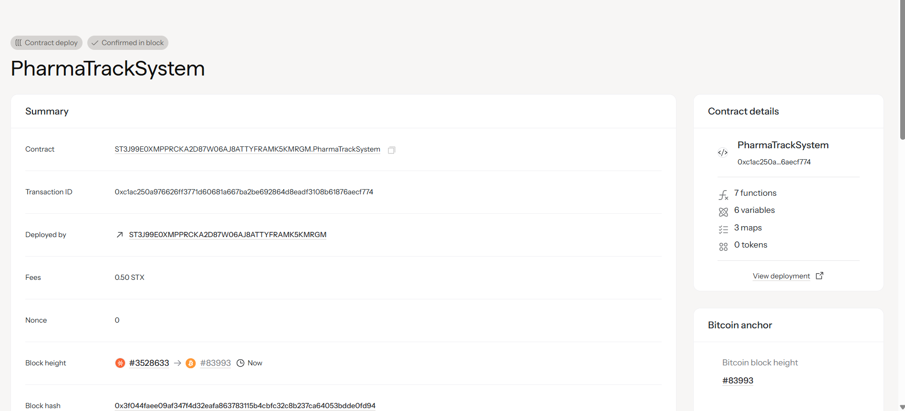

# PharmaTrack System

## Project Description

PharmaTrack System is a revolutionary blockchain-based pharmaceutical supply chain tracking solution built on the Stacks blockchain using Clarity smart contracts. The system prevents counterfeit drugs from entering the market and ensures patient safety by providing transparent, immutable tracking of pharmaceutical products from manufacturer to end consumer.

The platform enables authorized manufacturers to register pharmaceutical products with complete batch information, manufacturing dates, and expiry details. Healthcare providers, pharmacies, and consumers can verify drug authenticity in real-time, creating an unbreakable chain of trust in the pharmaceutical supply chain.

Key features include:
- **Immutable Drug Registration**: Secure recording of pharmaceutical products with comprehensive metadata
- **Real-time Verification**: Instant authentication of drug legitimacy and supply chain history
- **Manufacturer Authorization**: Controlled access ensuring only legitimate pharmaceutical companies can register products
- **Complete Audit Trail**: Transparent tracking of all verification events and supply chain movements
- **Counterfeit Prevention**: Blockchain-based verification makes drug counterfeiting virtually impossible

## Project Vision

To create a world where every pharmaceutical product can be instantly verified for authenticity, eliminating the $200+ billion annual global counterfeit drug market and saving millions of lives through enhanced drug safety and supply chain transparency.

Our vision encompasses:

### Short-term Goals (1-2 years)
- Deploy PharmaTrack on major pharmaceutical distribution networks
- Partner with leading drug manufacturers for initial product registrations
- Integrate with pharmacy management systems for seamless verification
- Develop mobile applications for consumer-level drug verification

### Medium-term Goals (3-5 years)
- Establish PharmaTrack as the global standard for pharmaceutical authentication
- Implement AI-powered supply chain analytics and predictive monitoring
- Expand to include medical devices and healthcare equipment tracking
- Create regulatory compliance automation for different international markets

### Long-term Goals (5+ years)
- Build a comprehensive healthcare ecosystem with patient outcome tracking
- Enable personalized medicine through secure patient data integration
- Develop smart contracts for automated insurance claims and drug recalls
- Create a global pharmaceutical transparency index and safety scoring system

## Future Scope

The PharmaTrack System has extensive potential for expansion and enhancement:

### Technical Enhancements
1. **Advanced Smart Contracts**
   - Automated drug recall mechanisms
   - Smart insurance claim processing
   - Temperature and storage condition monitoring
   - Expiry date alerts and automatic inventory management

2. **Integration Capabilities**
   - IoT sensor integration for real-time environmental monitoring
   - RFID and NFC tag compatibility for physical product verification
   - Integration with existing ERP systems in pharmaceutical companies
   - API development for third-party healthcare applications

3. **Scalability Solutions**
   - Layer 2 scaling solutions for high-volume transactions
   - Cross-chain compatibility with other blockchain networks
   - Edge computing integration for offline verification capabilities
   - Quantum-resistant cryptography implementation

### Industry Applications
1. **Regulatory Compliance**
   - Automated reporting to FDA, EMA, and other regulatory bodies
   - Compliance scoring and risk assessment algorithms
   - International trade documentation automation
   - Clinical trial drug tracking and verification

2. **Healthcare Ecosystem**
   - Patient medication history and interaction tracking
   - Personalized medicine dosage and effectiveness monitoring
   - Healthcare provider verification and credentialing
   - Medical research data integrity and provenance

3. **Supply Chain Optimization**
   - Predictive analytics for demand forecasting
   - Automated procurement and inventory management
   - Cold chain monitoring and temperature-sensitive drug tracking
   - Sustainability metrics and carbon footprint tracking

### Market Expansion
1. **Geographic Expansion**
   - Adaptation to different regulatory frameworks
   - Multi-language support and localization
   - Emerging market penetration strategies
   - International standardization initiatives

2. **Product Category Expansion**
   - Medical devices and equipment tracking
   - Clinical trial materials management
   - Vaccine distribution and authenticity verification
   - Over-the-counter medication tracking

## Contract Address Details
Contract ID: ST3J99E0XMPPRCKA2D87W06AJ8ATTYFRAMK5KMRGM.PharmaTrackSystem



### Testnet Deployment
- **Network**: Stacks Testnet
- **Contract Address**: [Contract address will be added after deployment]
- **Transaction ID**: [Deployment transaction ID will be added]

### Mainnet Deployment
- **Network**: Stacks Mainnet
- **Contract Address**: [Contract address will be added after deployment]
- **Transaction ID**: [Deployment transaction ID will be added]

### Contract Functions

#### Core Functions
1. **`register-drug`**: Register new pharmaceutical products in the supply chain
   - Parameters: drug-id, drug-name, batch-number, manufacture-date, expiry-date
   - Access: Authorized manufacturers only
   - Returns: Success confirmation

2. **`verify-drug`**: Verify and track pharmaceutical product authenticity
   - Parameters: drug-id
   - Access: Public
   - Returns: Complete drug information and verification status

#### Read-Only Functions
- **`get-drug-info`**: Retrieve comprehensive drug information
- **`is-manufacturer-authorized`**: Check manufacturer authorization status
- **`get-verification-history`**: Access verification audit trail

#### Administrative Functions
- **`add-authorized-manufacturer`**: Authorize new pharmaceutical manufacturers
- **`remove-authorized-manufacturer`**: Revoke manufacturer authorization

### Getting Started

1. **For Manufacturers**:
   ```clarity
   ;; Register a new drug (example)
   (contract-call? .pharmatrack-system register-drug 
     "DRUG001" 
     "Aspirin 100mg" 
     "BATCH2024001" 
     u1704067200  ;; manufacture date (timestamp)
     u1735689600  ;; expiry date (timestamp)
   )
   ```

2. **For Verifiers**:
   ```clarity
   ;; Verify a drug's authenticity
   (contract-call? .pharmatrack-system verify-drug "DRUG001")
   ```

### Security Features
- Multi-signature authorization for critical functions
- Immutable audit trails preventing tampering
- Cryptographic proof of authenticity
- Decentralized verification preventing single points of failure

### Contributing
PharmaTrack System is committed to open-source development and welcomes contributions from developers, healthcare professionals, and industry experts. Please refer to our contribution guidelines for more information.

### License
This project is licensed under the MIT License - see the LICENSE file for details.

### Support
For technical support, partnership inquiries, or general questions:
- Email: [Contact email to be added]
- Documentation: [Documentation link to be added]
- Community Forum: [Forum link to be added]

---
